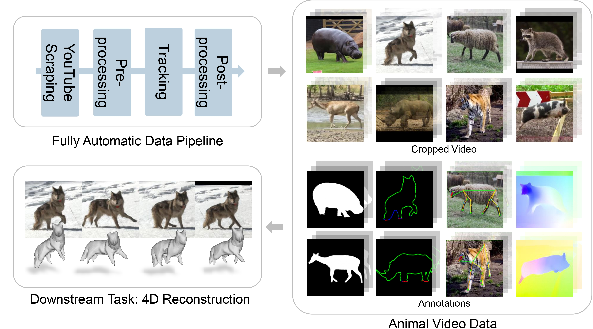

# Animal4D
Code repo for collecting and processing Animal4D data




## Installation 

The code is tested based on CUDA 12.1

Setup conda environment:

```shell
conda env create -f environment.yml
conda activate animal4d
```

Set Python path:

```shell
export PYTHONPATH=$(pwd)
```

Set OpenAI API key:

```shell
export OPENAI_API_KEY=your_openai_api_key
```

Initialize Git submodules:

```shell
git submodule update --init --recursive
```

Download Grounded-SAM2 checkpoint:

```shell
cd externals/Grounded_SAM2/checkpoints
wget https://dl.fbaipublicfiles.com/segment_anything_2/072824/sam2_hiera_large.pt
cd ../gdino_checkpoints
chmod +x download_ckpts.sh
./download_ckpts.sh
cd ../../..
```

Download ViTPose++ checkpoint:

```shell
mkdir externals/ViTPose/ckpt
cd externals/ViTPose/ckpt
wget https://download.cs.stanford.edu/viscam/Animal4D/ckpt/apt36k.pth
cd ../../..
```

Download DVT checkpoint:

```shell
mkdir externals/Denoising_ViT/ckpt
cd externals/Denoising_ViT/ckpt
wget https://huggingface.co/jjiaweiyang/DVT/resolve/main/imgnet_denoised/vit_base_patch14_dinov2.lvd142m.pth
wget https://huggingface.co/jjiaweiyang/DVT/resolve/main/voc_denoised/vit_small_patch14_dinov2.lvd142m.pth
cd ../../..
```

Or manually download from [Hugging Face](https://huggingface.co/jjiaweiyang/DVT)

## Data Collection

### Download Videos

```shell
python scripts/download_video.py --config configs/default.yml
```

This will produce a directory of unprocessed videos downloaded from YouTube.

### Preprocessing

```shell
python scripts/preprocess_video.py --config configs/default.yml
```

This will produce a directory of pre-filtered video clips split by shot changes.

### Run Tracking

```shell
python scripts/track_animal.py --config configs/default.yml
```

This will produce a directory of object-centric tracks of animals.

### Postprocessing

```shell
python scripts/build_dataset.py --config configs/default.yml
```
This will produce a dataset directory with post-filtered data split into train/test splits.

### DINO Features

Fit a PCA matrix from data:

```shell
python scripts/extract_dino_features.py --config configs/default.yml --pca_mode=fit
```

Or download a pre-fitted PCA matrix:

```shell
cd data
wget https://download.cs.stanford.edu/viscam/Animal4D/ckpt/fauna_pca.bin
cd ..
```

Apply PCA matrix to data:

```shell
python scripts/extract_feature.py --config configs/default.yml --pca_mode=apply --dataset_dir=path/to/datadir --pca_path=path/to/pca.bin
```

Optionally denoise the DINO features:

```shell
python scripts/extract_feature.py --config configs/default.yml --pca_mode=apply --dataset_dir=path/to/datadir --pca_path=path/to/pca.bin --denoise
```

This will add DINO features to the data in dataset directory.


## Acknowledgement

We have used code and models from the following repositories:

- [sam2](https://github.com/facebookresearch/sam2)
- [GroundingDINO](https://github.com/IDEA-Research/GroundingDINO)
- [Grounded-SAM-2](https://github.com/IDEA-Research/Grounded-SAM-2)
- [ViTPose](https://github.com/ViTAE-Transformer/ViTPose)
- [SEA-RAFT](https://github.com/princeton-vl/SEA-RAFT)
- [Denoising-ViT](https://github.com/Jiawei-Yang/Denoising-ViT)
- [Depth-Anything-V2](https://github.com/DepthAnything/Depth-Anything-V2)
- [video_object_processing](https://github.com/HusamJubran/video_object_processing)